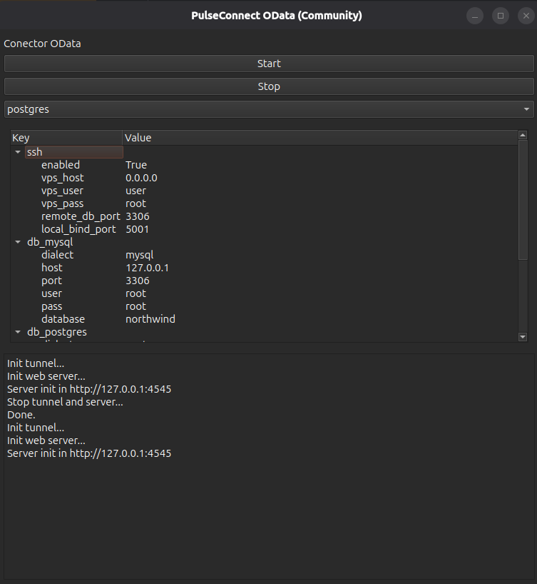

# PulseConnector (Community)


**PulseConnector** is a local database connector with a Python GUI that allows exposing your data via an OData service and connecting remotely from a VPS using SSH tunnels (forward and reverse).  

This project enables querying your local databases from a remote server securely, without opening public ports, with support for multiple database dialects (MySQL, PostgreSQL, SQL Server).

---

## Website: https://pulseconnector.ecuarobot.com

## Features

- **GUI (PySide6)** for:
  - Editing `config.json` visually in a key-value tree format.
  - Selecting the active database dialect using a ComboBox.
  - Viewing and dynamically updating connection parameters.

- **Local Python connector**:
  - Supports **SSH forward and reverse tunnels**.
  - Allows the VPS to query your **local OData service** through a reverse tunnel.
  - Automatically builds the connection string based on the selected dialect.

- **Embedded OData service** to expose local database data in a standard way.

---

## New Features

*December 13, 2025*
- Waitress server implementation
- Independent server thread
- Thread control
- High-demand feature configuration for threads
- High-demand feature configuration for odata

*November 29, 2025*
- ODATA allows data entry via JSON
- ODATA allows partial or complete updates of records via JSON.
- The configuration has a separate screen.

---
## Configuration (`config.json`)

Example configuration file:

```json
{
  "ssh": {
    "enabled": true,
    "mode": "reverse",
    "vps_host": "0.0.0.0",
    "vps_user": "user",
    "vps_pass": "root",
    "remote_db_port": 3306,
    "local_bind_port": 5001
  },
  "db_mysql": {
    "dialect": "mysql",
    "host": "127.0.0.1",
    "port": 3306,
    "user": "root",
    "pass": "root",
    "database": "northwind"
  },
  "db_postgres": {
    "dialect": "postgres",
    "host": "127.0.0.1",
    "port": 5432,
    "user": "postgres",
    "pass": "postgres",
    "database": "postgres"
  },
  "db_mssql": {
    "dialect": "mssql",
    "host": "127.0.0.1",
    "port": 1433,
    "user": "sa",
    "pass": "password",
    "database": "northwind"
  }
}
```
---
# Deployment

## Install dependencies

- pip install PySide6 sshtunnel sqlalchemy pymysql psycopg2 pyodbc
---

## Run the GUI
```
from gui_main import run_gui  # your main.py with MainWindow
import json

with open("config.json") as f:
    cfg = json.load(f)

run_gui(cfg)
```
---

## In the GUI

- Edit connection parameters visually.
- Select the active database dialect in the ComboBox.
- Start the SSH tunnel (forward or reverse, according to config).

First view


---

## Main Components

- JsonEditor: Visual editor of config.json with an expanded, editable tree structure.
- SshTunnelManager: Handles SSH forward and reverse tunnels from Python.
- build_connection_string(cfg): Builds the connection string according to the selected dialect.
- PySide6 GUI with dynamic ComboBox populated from db_* sections in JSON.
- Embedded OData service ready to expose your local database data.

---

## Security
- All tunnels use encrypted SSH connections.
- No need to open public ports on your local network.
- The reverse tunnel allows only the authorized VPS to access your OData.
---
## Possible Extensions

- Automatic reconnection if the SSH tunnel drops.
- Automatic validation of parameters according to the selected dialect.
- “Test Connection” button for each database.
- Activity logs and OData query logging.

---
# Use

## Test server
http://localhost:4545/status


# Instructions

## Select

**/odatab**: the web route

**/customer**: the table

**?**: add parameter in url

**$select**: statement that emulates a select

**id, company**: attributes of table

**Example:** 
```text
http://localhost:4545/odata/customers?$select=id,company
```
## $filters

**eq**: atributes c, v: c == v

**ne**: atributes c, v:  c != v,

**gt**: atributes c, v:  c > v,

**lt**: atributes c, v:  c < v,

**ge**: atributes c, v:  c >= v,

**le**: atributes c, v:  c <= v,

**like**: atributes c, v:  c.like(v)

**Test example:** 
```text
/data/customers?$select=id,company
        
/odata/products?$filter=precio gt 10

/odata/users?$filter=activo eq true

/odata/orders?$select=id,ship_name&$filter=ship_name like 'Karen%'
```

## Top
```text
/odata/Logs?$top=50
```

## Order by
```text
/odata/products?$orderby=precio desc

/odata/users?$orderby=nombre asc
```
## Combinations
```text
/odata/Productos?$select=id,nombre,precio&$filter=precio gt 20&$orderby=precio desc&$top=10
```


---
# Inserts

## Test using postman


# Update

## Total (PUT) - Test using postman


## Partial (PATCH) - Test using postman


# Server configuration

## Normal

```json
{
    "host": "0.0.0.0",
    "port": 5000,
    "threads": 8,
    "connection_limit": 100,
    "backlog": 512,
    "channel_timeout": 60,
    "cleanup_interval": 30
}
```

## High

```json
{
  "host": "0.0.0.0",
  "port": 5000,
  "threads": 32,
  "connection_limit": 1000,
  "backlog": 2048,
  "channel_timeout": 120,
  "cleanup_interval": 30
}
```

## OData configuration

## Normal

```json
    {
      "pool_size":20,
      "max_overflow":10,
      "pool_timeout":10,
      "pool_recycle":1800,
      "pool_pre_ping":"True"
    }
```

## High

```json
    {
      "pool_size":50,
      "max_overflow":100,
      "pool_timeout":30,
      "pool_recycle":1800,
      "pool_pre_ping":"True"
    }
```