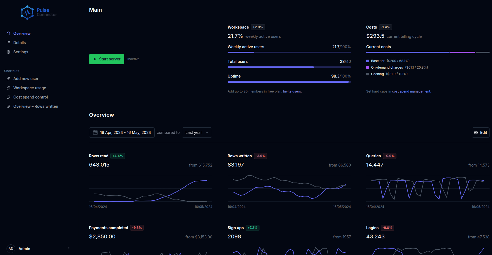
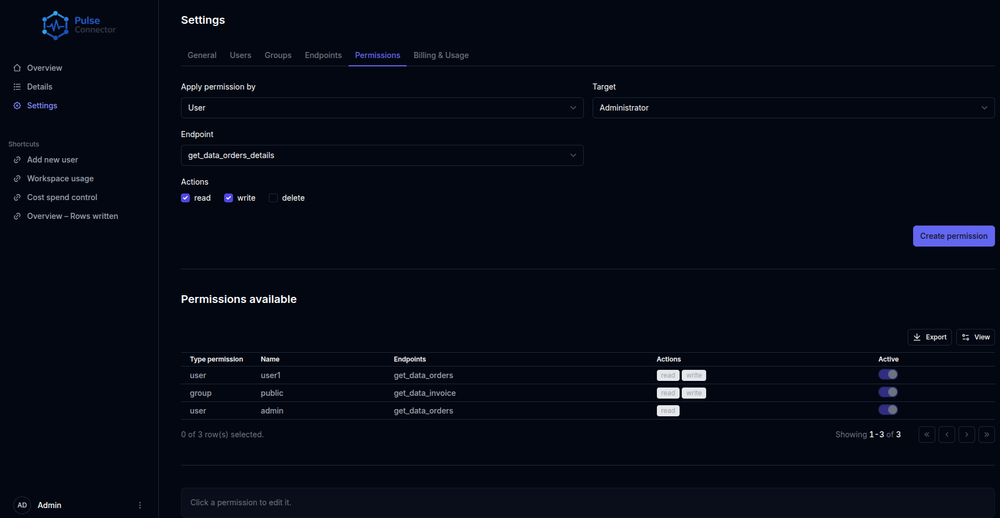
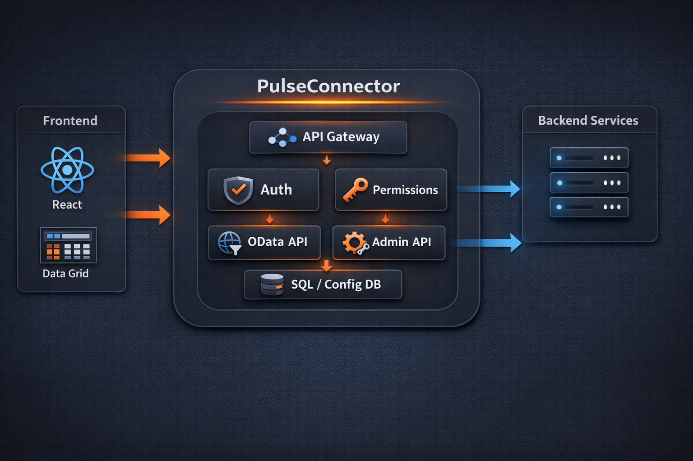
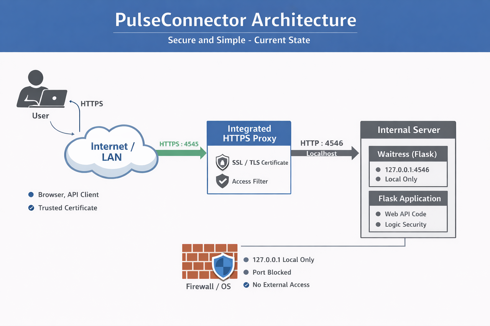
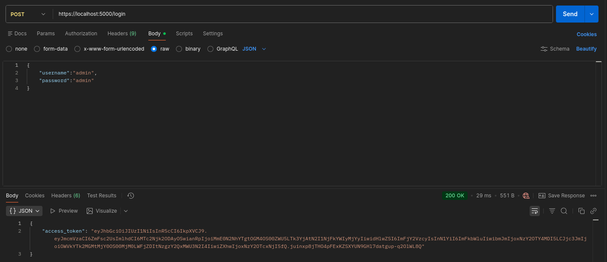
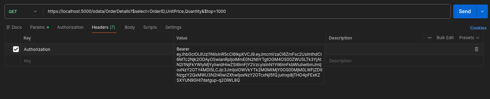
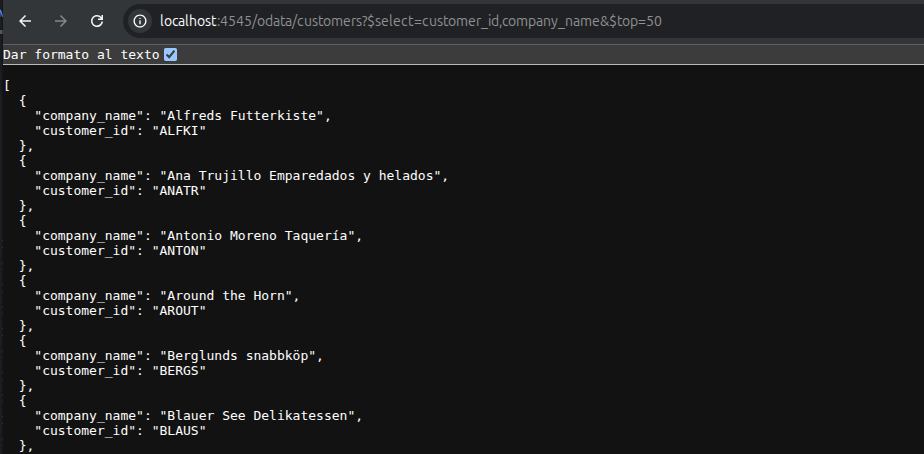
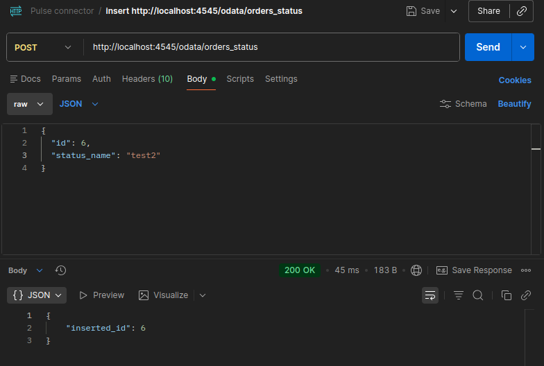
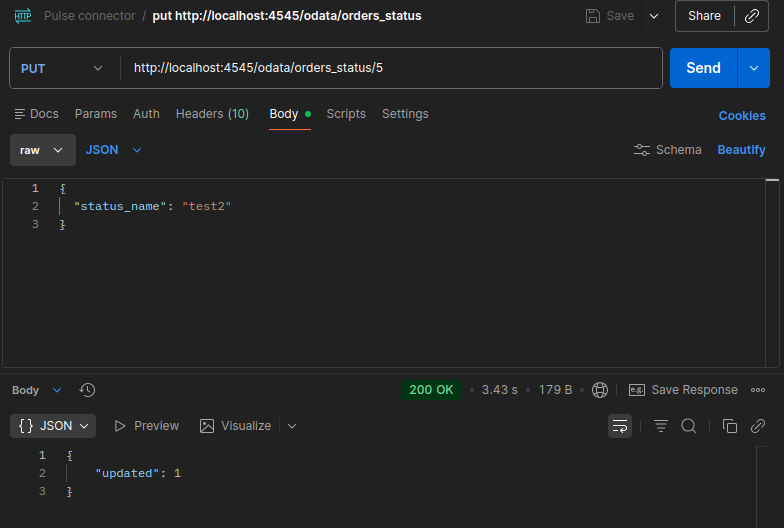
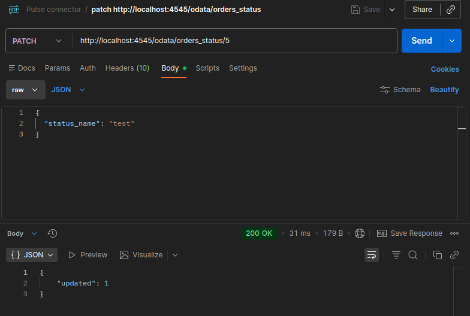

# PulseConnector


**PulseConnector** PulseConnector is a lightweight Python database connector that transforms your data into a ready-to-use OData API in minutes


---

## Website: https://pulseconnector.ecuarobot.com

# Features





- Fast access to MSSQL, MySQL/MariaDB, PotgreSQL and other databases without writing additional code.

- Complete management from a modern GUI in PySide6.

- Built-in SSH tunnels for secure connectivity to remote databases.

- Lightweight backend with Waitress, compatible with Windows and Linux.

- Ideal for developers and administrators who need to expose data securely and quickly.


- ## [Benchmark](docs/benchmark.md)

- ## [Installer](docs/installer.md)

---

# General architecture




---

# Network architecture



---
# Features

PulseConnector is a lightweight, configuration-driven API gateway and permission engine designed to centralize authentication, authorization, and data access. It provides a unified OData-style interface for backend services, enabling fine-grained access control and dynamic endpoint management without hardcoding business rules into the application.

## ✨ Key Features — PulseConnector

- **JWT-based Authentication**
  - Secure token-based authentication for all protected routes.
  - Centralized identity handling across the API.

- **Fine-Grained Authorization Engine**
  - Permission checks based on:
    - user / subject
    - namespace
    - endpoint
    - action (`read`, `write`, etc.)
  - Fully decoupled from route implementation.

- **Dynamic Permission Configuration**
  - Permissions are configuration-driven, not hardcoded.
  - Endpoints and actions can be enabled/disabled without code changes.
  - Designed to scale as new services and resources are added.

- **Generic OData-style API**
  - Single dynamic endpoint:
    ```
    /api/odata/<namespace>/<endpoint>
    ```
  - Endpoint resolution via internal configuration mapping.
  - Supports OData-like query parameters:
    - `$select`
    - `$top`
    - `$filter` (extensible)

- **Modular Flask Architecture**
  - Clean separation using Flask Blueprints.
  - Logical grouping of:
    - admin routes
    - api routes
    - odata endpoints
  - Production-ready structure.

- **SQLite Configuration Store**
  - SQLite used as a lightweight configuration database.
  - Stores users, permissions, endpoints, and metadata.
  - No external services required to boot the system.

- **Admin API**
  - Dedicated admin endpoints for:
    - permissions
    - users
    - endpoint access
  - Designed for internal management and tooling.

- **Frontend-Friendly Design**
  - JSON responses optimized for dynamic UIs (React, data grids).
  - Column rendering and permissions resolved at runtime.
  - Ideal for generic admin dashboards.

- **Production-Oriented Development Flow**
  - Compatible with WSGI servers (e.g. Waitress).
  - Development setup aligned with production architecture.


---
## Configuration (`config.json`)

Example configuration file:

```json
{
    "server": {
        "host": "127.0.0.1",
        "port": 5000,
        "protocol": "http",
        "threads": 8,
        "connection_limit": 100,
        "backlog": 512,
        "channel_timeout": 60,
        "cleanup_interval": 30
    },
    "odata": {
        "pool_size": 20,
        "max_overflow": 10,
        "pool_timeout": 10,
        "pool_recycle": 1800,
        "pool_pre_ping": true
    },
    "active_dialect": "mssql"
}
```
---
# Use

## Test local server

- local: http://localhost:4545/status
- remote: https://localhost:5000/status

---

# Login and access

https://localhost:5000/login

## Generate token


```json
{
    "username":"admin",
    "password":"admin"
}
```

## Use token bearer in query



---
# Instructions for making queries using ODATA

## Select

**/odatab**: the web route

**/customer**: the table

**?**: add parameter in url

**$select**: statement that emulates a select

**id, company**: attributes of table

**Example:** 
```text
https://localhost:5000/odata/customers?$select=id,company
```
## $filters

**eq**: atributes c, v: c == v

**ne**: atributes c, v:  c != v,

**gt**: atributes c, v:  c > v,

**lt**: atributes c, v:  c < v,

**ge**: atributes c, v:  c >= v,

**le**: atributes c, v:  c <= v,

**like**: atributes c, v:  c.like(v)

**Test example:** 
```text
/data/customers?$select=id,company
        
/odata/products?$filter=precio gt 10

/odata/users?$filter=activo eq true

/odata/orders?$select=id,ship_name&$filter=ship_name like 'Karen%'
```

## Top
```text
/odata/Logs?$top=50
```

## Order by
```text
/odata/products?$orderby=precio desc

/odata/users?$orderby=nombre asc
```
## Combinations
```text
/odata/Productos?$select=id,nombre,precio&$filter=precio gt 20&$orderby=precio desc&$top=10
```


---
# Inserts

## Test using postman




# Update

## Total (PUT) - Test using postman




## Partial (PATCH) - Test using postman



---

# Server configuration

## Normal

```json
{
    "host": "0.0.0.0",
    "port": 5000,
    "threads": 8,
    "connection_limit": 100,
    "backlog": 512,
    "channel_timeout": 60,
    "cleanup_interval": 30
}
```

## High

```json
{
  "host": "0.0.0.0",
  "port": 5000,
  "threads": 32,
  "connection_limit": 1000,
  "backlog": 2048,
  "channel_timeout": 120,
  "cleanup_interval": 30
}
```

---

## OData configuration

## Normal

```json
    {
      "pool_size":20,
      "max_overflow":10,
      "pool_timeout":10,
      "pool_recycle":1800,
      "pool_pre_ping":"True"
    }
```

## High

```json
    {
      "pool_size":50,
      "max_overflow":100,
      "pool_timeout":30,
      "pool_recycle":1800,
      "pool_pre_ping":"True"
    }
```

# Logs
## Logs in linux

- General read
```shell
journalctl -t PulseConnector
```

- Real time
```shell
journalctl -t PulseConnector -f
```

- Only errors
```shell
journalctl -t PulseConnector -p err
```

- Path ubuntu
```shell
grep PulseConnector /var/log/syslog
```

- Path RHEL / CentOS / Rocky
```shell
grep PulseConnector /var/log/messages
```

## Logs in windows
- Use view event
  - eventvwr.msc
  - filter events: PulseConnector
---

# License

This project is free for non-commercial use.

Commercial use requires prior written authorization from the author.

---

This application collects anonymous usage metrics to improve the product.
No personal or customer data is collected.